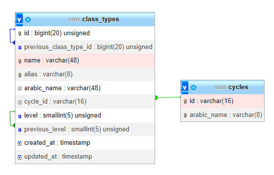

# Seeded tables

## cycles

`create_cycles_table` migration + `CycleSeeder` or `AlgerianEducationSystemSeeder`

| id             | arabic_name |
| -------------- | ----------- |
| "pre-scolaire" | "تحضيري"    |
| "primaire"     | "ابتدائي"    |
| "moyen"        | "متوسط"    |
| "secondaire"   | "ثانوي"    |

## class_types

`create_class_types_table` migration + `ClassTypeSeeder` or `AlgerianEducationSystemSeeder`

| id  | previous_class_type_id | name                                | alias    | arabic_name | cycle_id       | level | previous_level | created_at | updated_at |
| --- | ---------------------- | ----------------------------------- | -------- | ----------- | -------------- | ----- | -------------- | ---------- | ---------- |
| 1   | NULL                   | "pre-scolaire"                      | "pre"    |             | "pre-scolaire" | 1     | NULL           |            |            |
| 2   | 1                      | "1re AP"                            | "1ap"    |             | "primaire"     | 2     | 1              |            |            |
| 3   | 2                      | "2e AP"                             | "2ap"    |             | "primaire"     | 3     | 2              |            |            |
| 4   | 3                      | "3e AP"                             | "3ap"    |             | "primaire"     | 4     | 3              |            |            |
| 5   | 4                      | "4e AP"                             | "4ap"    |             | "primaire"     | 5     | 4              |            |            |
| 6   | 5                      | "5e AP"                             | "5ap"    |             | "primaire"     | 6     | 5              |            |            |
| 7   | 6                      | "1re AM"                            | "1am"    |             | "moyen"        | 7     | 6              |            |            |
| 8   | 7                      | "2e AM"                             | "2am"    |             | "moyen"        | 8     | 7              |            |            |
| 9   | 8                      | "3e AM"                             | "3am"    |             | "moyen"        | 9     | 8              |            |            |
| 10  | 9                      | "4e AM"                             | "4am"    |             | "moyen"        | 10    | 9              |            |            |
| 11  | 10                     | "1re AS TC sciences et technologie" | "1as-st" |             | "secondaire"   | 11    | 10             |            |            |
| 12  | 10                     | "1re AS TC lettres"                 | "1as-l"  |             | "secondaire"   | 11    | 10             |            |            |
| 13  | 11                     | "2e AS sciences experimentales"     | "2as-s"  |             | "secondaire"   | 12    | 11             |            |            |
| 14  | 11                     | "2e AS gestion et economie"         | "2as-ge" |             | "secondaire"   | 12    | 11             |            |            |
| 15  | 11                     | "2e AS math"                        | "2as-m"  |             | "secondaire"   | 12    | 11             |            |            |
| 16  | 11                     | "2e AS technique mathematique"      | "2as-tm" |             | "secondaire"   | 12    | 11             |            |            |
| 17  | 12                     | "2e AS langues etrangeres"          | "2as-le" |             | "secondaire"   | 12    | 11             |            |            |
| 18  | 12                     | "2e AS lettres - philosophie"       | "2as-lp" |             | "secondaire"   | 12    | 11             |            |            |
| 19  | 13                     | "3e AS sciences experimentales"     | "3as-s"  |             | "secondaire"   | 13    | 12             |            |            |
| 20  | 14                     | "3e AS gestion et economie"         | "3as-ge" |             | "secondaire"   | 13    | 12             |            |            |
| 21  | 15                     | "3e AS math"                        | "3as-m"  |             | "secondaire"   | 13    | 12             |            |            |
| 22  | 16                     | "3e AS technique mathematique"      | "3as-tm" |             | "secondaire"   | 13    | 12             |            |            |
| 23  | 17                     | "3e AS langues etrangeres"          | "3as-le" |             | "secondaire"   | 13    | 12             |            |            |
| 24  | 18                     | "3e AS lettres - philosophie"       | "3as-lp" |             | "secondaire"   | 13    | 12             |            |            |

## References

All the data is gathered exclusively from https://www.education.gov.dz/fr/systeme-educatif-algerien/ ([ar](https://www.education.gov.dz/%d8%a7%d9%84%d9%86%d8%b8%d8%a7%d9%85-%d8%a7%d9%84%d8%aa%d8%b1%d8%a8%d9%88%d9%8a-%d8%a7%d9%84%d8%ac%d8%b2%d8%a7%d8%a6%d8%b1%d9%8a/))

